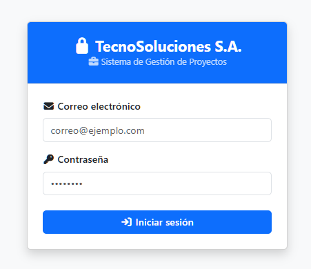
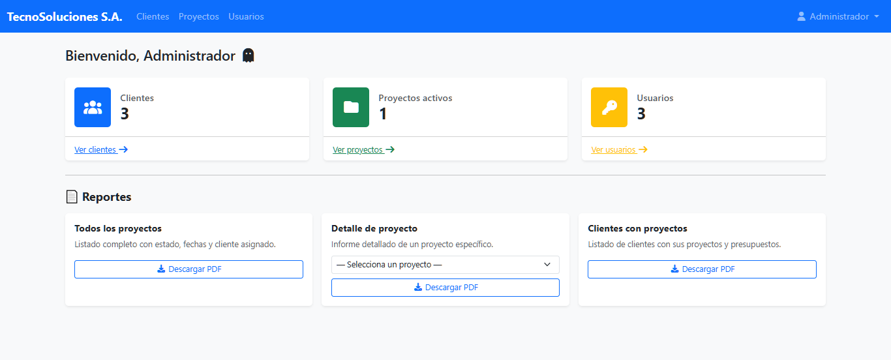
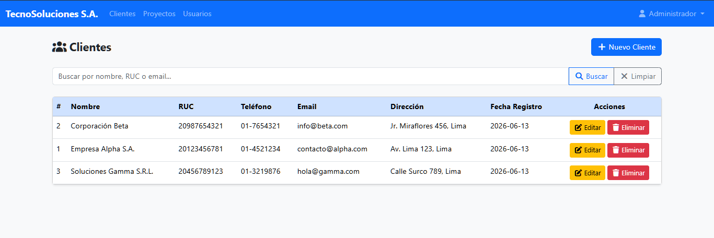
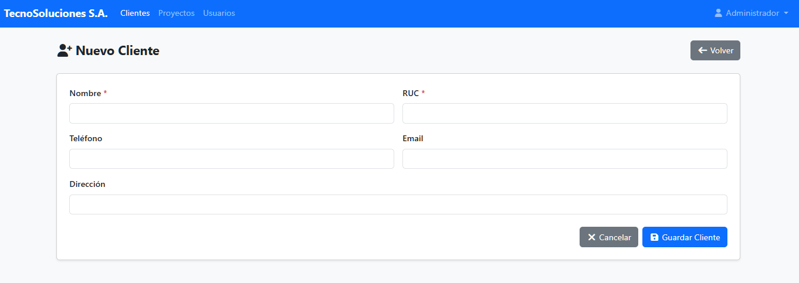
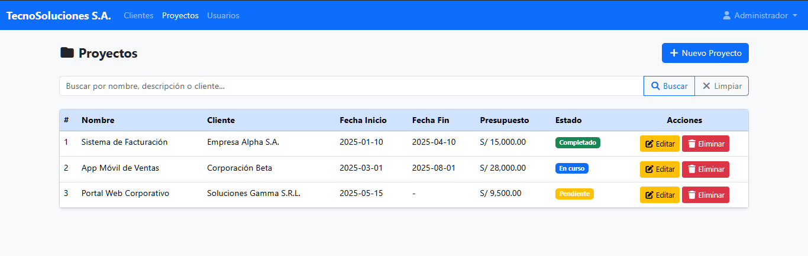
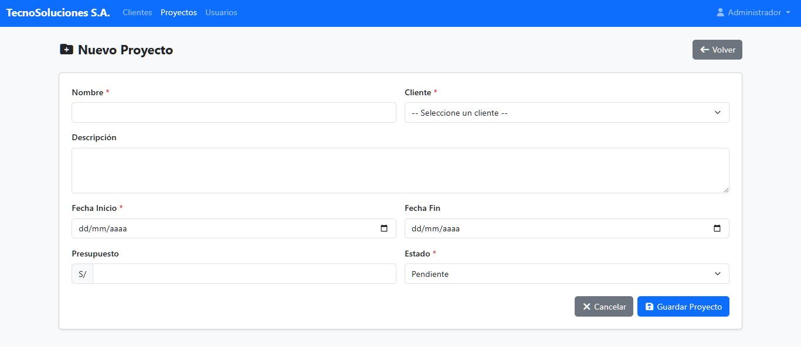
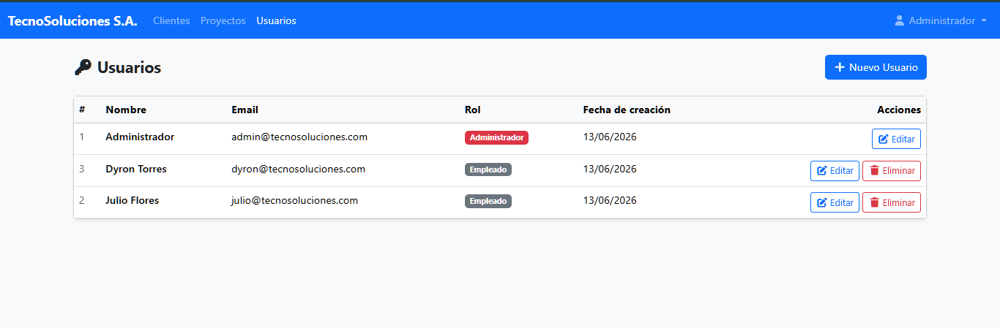
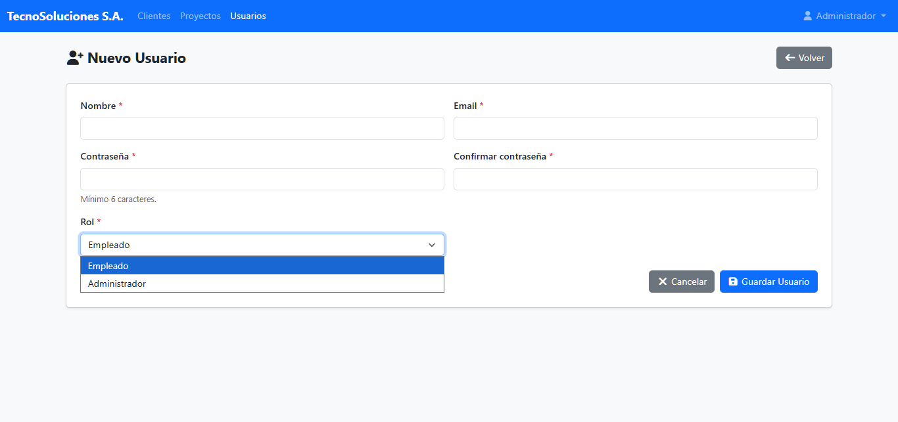

# TecnoSolucionesWEB

Sistema de Gestión de Proyectos accesible vía web, desarrollado para **TecnoSoluciones S.A.**, empresa que brinda soluciones de software a pequeñas y medianas empresas. Proyecto realizado como Trabajo Final del curso *Backend Developer Web* (SENATI).

## 📋 Descripción del proyecto

TecnoSoluciones S.A. contaba con un sistema interno de gestión de clientes y proyectos limitado solo a las computadoras de la oficina, lo que dificultaba el trabajo remoto y la gestión de datos en tiempo real.

Este proyecto resuelve ese problema con un sistema web completo que permite administrar **usuarios, clientes y proyectos**, con autenticación segura y generación de reportes en PDF para la gerencia.

## ✨ Características principales

- **Autenticación de usuarios** con roles (`administrador` / `empleado`), contraseñas cifradas con `password_hash` / `password_verify`, y sesiones PHP con cierre seguro (`session_unset()` + `session_destroy()`).
- **Arquitectura MVC** con enrutamiento por `controller`/`action` (`index.php?controller=...&action=...`).
- **Gestión de clientes**: alta, edición, listado (con RUC único, contacto y dirección).
- **Gestión de proyectos**: alta, edición, listado, estados (`pendiente`, `en curso`, `completado`, `cancelado`), presupuesto y relación con cliente.
- **Gestión de usuarios** del sistema (crear, editar, listar).
- **Dashboard** con vista general del sistema.
- **Reportes en PDF** generados con **TCPDF**, renderizados en línea (`Output(..., 'I')`):
  - Reporte general de proyectos (tabla con cliente, estado, fechas y presupuesto).
  - Detalle individual de un proyecto.
  - Reporte de clientes con sus proyectos asociados.
- **Base de datos MySQL** en `utf8mb4`, con nombres de tablas/columnas en español y clave foránea entre `PROYECTOS` y `CLIENTES`.

## 🛠️ Tecnologías utilizadas

| Tecnología | Uso |
|---|---|
| PHP (POO) | Lógica de la aplicación, patrón MVC |
| MySQL | Base de datos (`tecnosolucionesweb`) |
| PDO | Acceso a datos (prepared statements, `ATTR_EMULATE_PREPARES` desactivado) |
| Bootstrap 5 (local) | Interfaz web, sin dependencia de CDN |
| Font Awesome (local) | Iconografía |
| TCPDF | Generación de reportes en PDF |
| Sesiones PHP | Autenticación y control de acceso |

## 🗂️ Estructura del proyecto

```
TecnoSolucionesWEB/
├── Config/
│   ├── Config.php            # Constantes de la app (nombre, URL, sesión, rutas)
│   └── Database.php          # Conexión PDO a MySQL
├── Controllers/
│   ├── AuthController.php        # Login / logout
│   ├── DashboardController.php   # Panel principal
│   ├── ClientesController.php    # CRUD de clientes
│   ├── ProyectosController.php   # CRUD de proyectos
│   ├── UsuariosController.php    # CRUD de usuarios del sistema
│   └── ReportesController.php    # Generación de reportes PDF (TCPDF)
├── Models/
│   ├── Usuarios.php
│   ├── Clientes.php
│   └── Proyectos.php
├── Views/
│   ├── Auth/            # login.php, logout.php
│   ├── Clientes/        # index, crear, editar
│   ├── Proyectos/       # index, crear, editar
│   ├── Usuarios/        # index, crear, editar, mensaje
│   ├── Dashboard/       # dashboard.php
│   └── Reportes/        # index.php
├── Helpers/
│   └── tcpdf/           # Librería TCPDF
├── Assets/
│   ├── CSS/             # Bootstrap 5 (local)
│   └── JS/              # Bootstrap bundle, Font Awesome (local)
├── index.php            # Punto de entrada / enrutador
└── README.md
```

## 🗃️ Modelo de base de datos

Tablas principales (`TecnoSoluciones_DB.sql`):

- **USUARIOS**: `id`, `nombre`, `email` (único), `password` (hash), `rol` (`administrador` / `empleado`), `fecha_creacion`.
- **CLIENTES**: `id`, `nombre`, `ruc` (único), `telefono`, `email`, `direccion`, `fecha_registro`.
- **PROYECTOS**: `id`, `nombre`, `descripcion`, `fecha_inicio`, `fecha_fin`, `estado`, `presupuesto`, `cliente_id` (FK → `CLIENTES.id`, `ON DELETE RESTRICT`, `ON UPDATE CASCADE`), `fecha_creacion`.

## ⚙️ Instalación y configuración

### Requisitos previos

- PHP 7.4 o superior (con extensión PDO habilitada)
- MySQL 5.7 o superior / MariaDB
- Servidor web local (XAMPP, WAMP o similar)

### Pasos

1. Clonar el repositorio dentro de la carpeta de tu servidor local (ej. `htdocs` en XAMPP):
   ```bash
   git clone https://github.com/Dyronnt/TecnoSolucionesWEB.git
   ```
2. Importar la base de datos incluida (`TecnoSoluciones_DB.sql`), que ya crea la base `tecnosolucionesweb` en `utf8mb4` y carga un usuario administrador de prueba:
   ```bash
   mysql -u root -p < TecnoSoluciones_DB.sql
   ```
3. Verificar la conexión en `Config/Database.php` (por defecto: host `localhost`, usuario `root`, sin contraseña):
   ```php
   private $host = "localhost";
   private $user = "root";
   private $password = "";
   private $dbname = "tecnosolucionesweb";
   ```
4. Ajustar `APP_URL` en `Config/Config.php` si tu proyecto no corre en `http://localhost/TecnoSolucionesWEB`.
5. Iniciar Apache/MySQL y acceder desde el navegador:
   ```
   http://localhost/TecnoSolucionesWEB/
   ```

### Credenciales de prueba

> Usuario y contraseña incluidos en el script SQL, solo para entorno de desarrollo local.

- **Email:** `admin@tecnosoluciones.com`
- **Contraseña:** `t3cn0_s0luc10n3s`

## ▶️ Uso

1. Iniciar sesión con las credenciales de prueba (o un usuario creado).
2. Desde el **Dashboard**, navegar a los módulos de **Clientes**, **Proyectos** o **Usuarios**.
3. Registrar/editar clientes y proyectos (cada proyecto se asocia a un cliente existente).
4. Ir al módulo de **Reportes** para generar y visualizar en línea:
   - Reporte general de todos los proyectos.
   - Detalle de un proyecto específico.
   - Reporte de clientes con sus proyectos.
5. Cerrar sesión de forma segura desde el menú de usuario.

## 📸 Capturas de pantalla


Login:



Dashboard (Admin):



Gestión de Clientes:



Registrar Clientes:



Gestión de Proyectos:



Registrar Proyectos:



Gestión de Usuarios:



Registrar Usuarios:




## 👤 Autor

**Dyron Rod James Torres Sánchez**
Estudiante de Ingeniería de Software con Inteligencia Artificial — SENATI
📧 dyrontorresanchez@gmail.com

## 📄 Licencia

Proyecto académico desarrollado con fines educativos para el curso *Backend Developer Web* (SENATI). Incluye la librería de terceros TCPDF bajo su propia licencia (ver `Helpers/tcpdf/LICENSE.TXT`).
